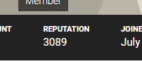

NerdFitness forum - Display reputation
======================================

Shows each users's reputation in the user sidebar, and on the user's profile
page, on NerdFitness Rebellion forums.

The script will cache reputation scores locally for each user, so the first
time you run the script and/or the first time you see a post from a new user it
will take a longer time to display the reputation. When a reputation has been
fetched it will be cached.

When a user's reputation is cached, the cached score will be displayed first,
and a fresh reputation score will be fetched in the background. When the new
score is available the user will be updated.
